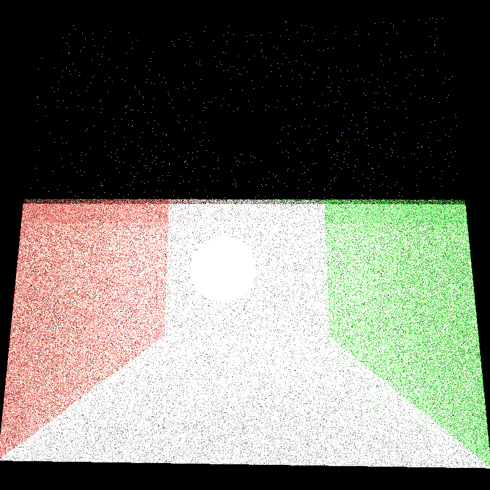
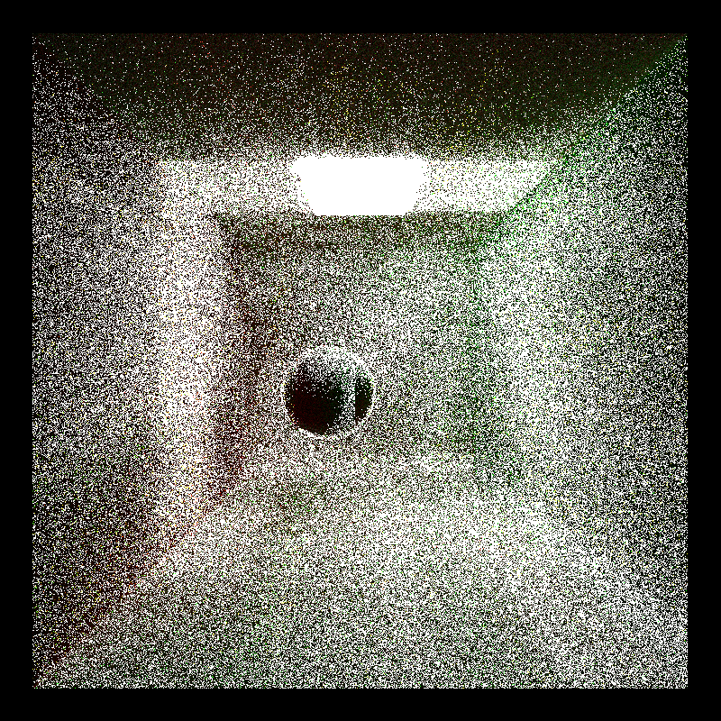
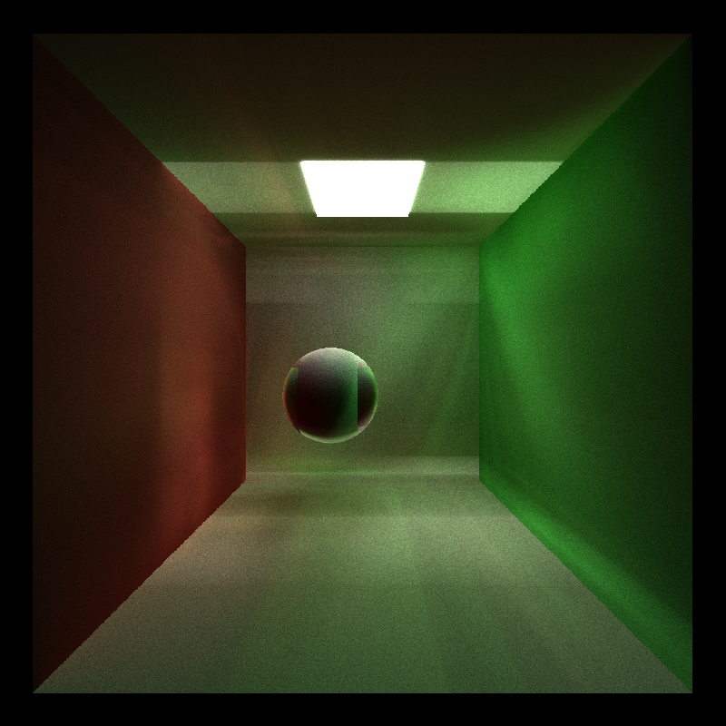
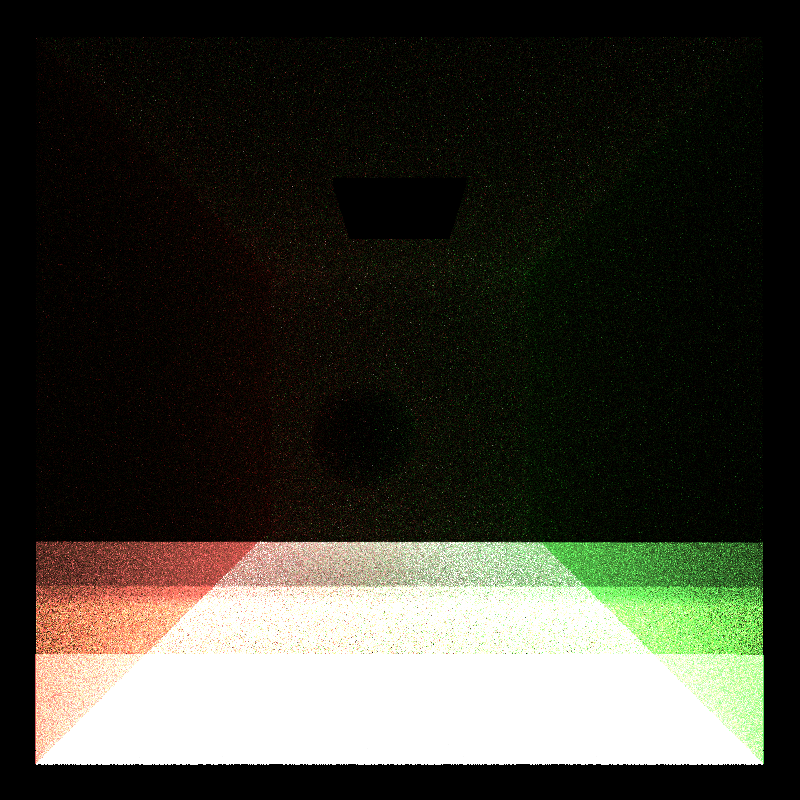
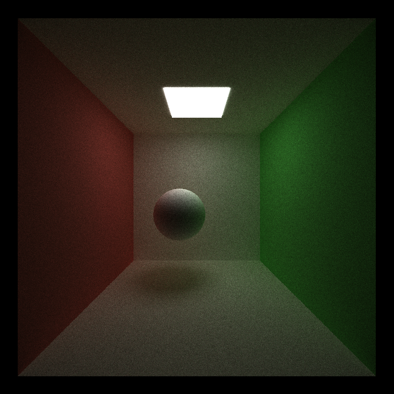

CUDA Path Tracer
================

**University of Pennsylvania, CIS 565: GPU Programming and Architecture, Project 3**

* Gabriel Naghi
* Tested on: Windows 10, i7-2600 @ 3.40GHz 8GB, GT 730 1024 MB

## Overview

In this project, we are asked to implement a basic parallel path tracer. 

In computer graphics, a path tracer is a redering technique in which light rays  are bounced into a scene through a camera and, based on the trejectory and collisions incurred, pixels colored accordingly. 

In short, the algorithm for a path tracer is as follows:

1. Fire rays into the scene.
2. Calulate if any object exists on the ray's trejectory.
3. If no collisions occur or object hits a light, color the ray black or white, respectively. If there is a collision, color the ray according to the material and generate a new ray eminating from the object's surface. 
4. Repeat steps 2 and 3 until all rays have been colored or until a maximum number of bounces has been reached.
5. Color pixes in an ouput image according to the map generated by the rays.
6. Repeat as desired from step 1. The more iterations, the more refined the image will become. 

### Basic Path Tracer

For the basic path tracer, we were asked only to treat objects in the scene as diffuse surfaces. Unfortuately, I had some trouble exacerbated by the fact that I tried to throw in spectral surfaces and stream compaction. This worked OK for the basic sphere.txt scene depected here:

Unfortunately, it didn't seem to do as well for the Cornell scene. The image I stared at for many hours looked like this:

A few things were evidently wrong here. THe light was completely black; the sphere was compoletely white; the pixels colored by the walls seemed to pick up only the most basic coloring. 

After much time, the logical thing to do (and that suggested by the TAs) was to cut featueres and try to get a more basic implementation working; obviously. 

So after some code snipping and slight patching, my images started to take form:

Much better, but not quite. The image didn't stabilize at this point either. It would continut to increase in whiteness until more or less the whole image was flushed out. It was pretty obvious that this was an issue with repeatedly lighting rays. To be frank, I'm not sure exactly what fixed this, but after I rearraged some code relating to rays bottoming out, the implementation suddenly began to work like a charm. 

####Stream Compaction

I fell into the trap reported in the google group: thrust::remove_if does not move the "removed" elements to the end of the array per se. So my initial implementation looked like this: 

We see here a lot of the color concentration nastiness observed in the first picture above.

The solution was to rather use thrust::partition, moving the elements with bounces left to the front of the array while pushing those which had already bottomed out to the end of the array. The resulting image is even nicer than the bas implementation (for some reason) :

### Feature 1

### Feature 2

## Performance Analysis

