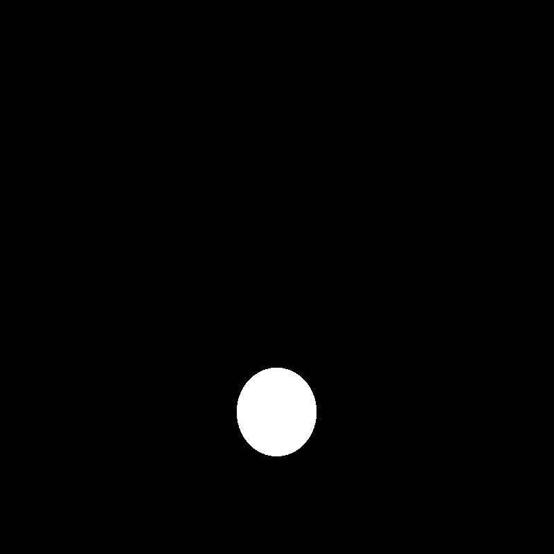
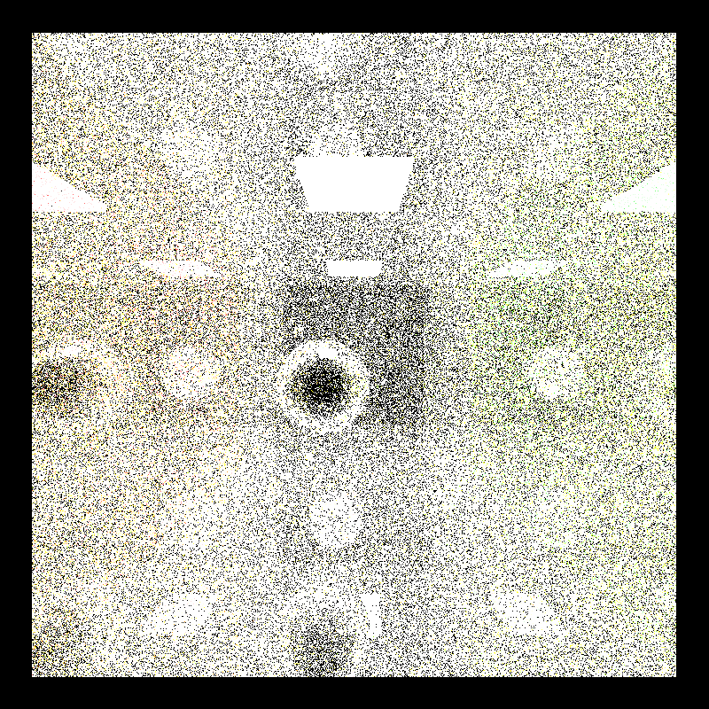

CUDA Path Tracer
================

**University of Pennsylvania, CIS 565: GPU Programming and Architecture, Project 3**

* Gabriel Naghi
* Tested on: Windows 10, i7-2600 @ 3.40GHz 8GB, GT 730 1024 MB

## Overview

In this project, we are asked to implement a basic parallel path tracer. 

In computer graphics, a path tracer is a redering technique in which light rays  are bounced into a scene through a camera and, based on the trejectory and collisions incurred, pixels colored accordingly. 

In short, the algorithm for a path tracer is as follows:

1. Fire rays into the scene.
2. Calulate if any object exists on the ray's trejectory.
3. If no collisions occur or object hits a light, color the ray black or white, respectively. If there is a collision, color the ray according to the material and generate a new ray eminating from the object's surface. 
4. Repeat steps 2 and 3 until all rays have been colored or until a maximum number of bounces has been reached.
5. Color pixes in an ouput image according to the map generated by the rays.
6. Repeat as desired from step 1. The more iterations, the more refined the image will become. 

### Basic Path Tracer

For the basic path tracer, we were asked only to treat objects in the scene as diffuse surfaces. Unfortuately, I had some trouble exacerbated by the fact that I tried to throw in spectral surfaces and stream compaction. This worked OK for the basic sphere.txt scene depected here:

Unfortunately, it didn't seem to do as well for the Cornell scene. The image I stared at for many hours looked like this:

A few things were evidently wrong here. THe light was completely black; the sphere was compoletely white; the pixels colored by the walls seemed to pick up only the most basic coloring. 

After much time, the logical thing to do (and that suggested by the TAs) was to cut featueres and try to get a more basic implementation working; obviously. 

So after some code snipping and slight patching, my images started to take form:

Much better, but not quite. The image didn't stabilize at this point either. It would continut to increase in whiteness until more or less the whole image was flushed out. It was pretty obvious that this was an issue with repeatedly lighting rays. To be frank, I'm not sure exactly what fixed this, but after I rearraged some code relating to rays bottoming out, the implementation suddenly began to work like a charm. 

####Stream Compaction

I fell into the trap reported in the google group: thrust::remove_if does not move the "removed" elements to the end of the array per se. So my initial implementation looked like this: 

We see here a lot of the color concentration nastiness observed in the first picture above.

The solution was to rather use thrust::partition, moving the elements with bounces left to the front of the array while pushing those which had already bottomed out to the end of the array. The resulting image is even nicer than the bas implementation (for some reason) :

####BSDF

Another basic feature we were asked to implement was a BSDF shader. In essence, a BSDF shader combines spectral and diffuse shading. (The above images are pure-diffuse)

It was entirely unuclear to me based on instructions what we were intended to do for this component. As far as I could tell, on a given iteration, we were supposed to randomly choose one of the two features, do the computation for that type, and divide by half (multipy by 2). But that resulted in this: 

 

Luckily, @dgrosman was able to enlighten me as to a proper way to do this, taking the components proportionally if they existed. That turned out this nice image: 

#### Contiguous Memory Optimization

One problem faced by our shader is the possibility of branching in adjacent threads in a warp. This leads to inefficiencies because all threads must wait for all other threads in a warp, so incongruous execution is costly. 

This can be avoided by ensuring that adjacent threads (nearly) always take the same branch. In the case of our shader, that means making sure that the material properties and thus shading algorithm is the same. 

The way to do this is to sort the paths and intersections arrays by material ID. I was able to do this using a very simple thrust::sort_by_key call, using intersctions as keys and comparing them based on their material ID, while using the paths as values. 

Many individuals had trouble with this optimization, saying that it in fact caused their iterations to take longer. Indeed, I found the same problem to be present in my performance analysis:

At first, I thought I could be this problem by selectively applying the material sort. Id made sense to me that when there are a large number of paths present, this would be most helpful. But alas, analysis revealed that any number of sortions negatively impacted performance. 

### Feature 1.1- Schlick Approximation

For my first personal feature, I implmemented Schlick's approximation of the Fresnel factor -- in essence, it allows us to accurately model the specular reflection of light between media. This is made easier in our case, since one of the two media is alwasys air, which has idex of refreaction of 1. So our equaitions are:

~~~
R(theta) = R0 + (1 - R0)(1 - cos(theta))^5
R0 = ((1 - refraction_index)/(1 + refraction_index))^2
cos(theta) = dot(normal, ray_direction)
~~~ 

This is easily caclulable since normal, ray\_direction, and refraction_index are readily available in the shader. 

***non purely spectral image here***

### Feature 1.2- Anti Aliasing
***Not completed***

### Feature 2- Hemisphere Sampling

In our ray scattering function, we what to scatter rays in a cosine-weighted hemisphere when refrating from a diffuse surface. 

The way to do this as described by [UCSD Graphics](http://graphics.ucsd.edu/courses/cse168_s14/ucsd/CSE168_11_Random.pdf) is as follows:

~~~
Choose a random point (s,t)
u = 2πs
v = sqrt(1-t)

px = v * cos(u)
py = sqrt(t)
pz = v * sin(u)
~~~

Unfortunatly, although this may be an efficient implementation, it doesnt look very good. Here is an image with the new cosine-weighted hemisphere sampling:

## Performance Analysis

Stream compaction was definitely one of the more significant optimizations made over the course of this project. It is interesting how the effect varies from scene to scene. For example, in the Cornell scene, Stream Compaction is significant but only wittles away a relatively small number of paths per iteration. On the other hand, on an open scene like the Sphere, Stream compaction immidately removes all the paths, which have been terminated. 

Indeed the duratin of a single iteration is sharply reduced by the compaction of paths. 

